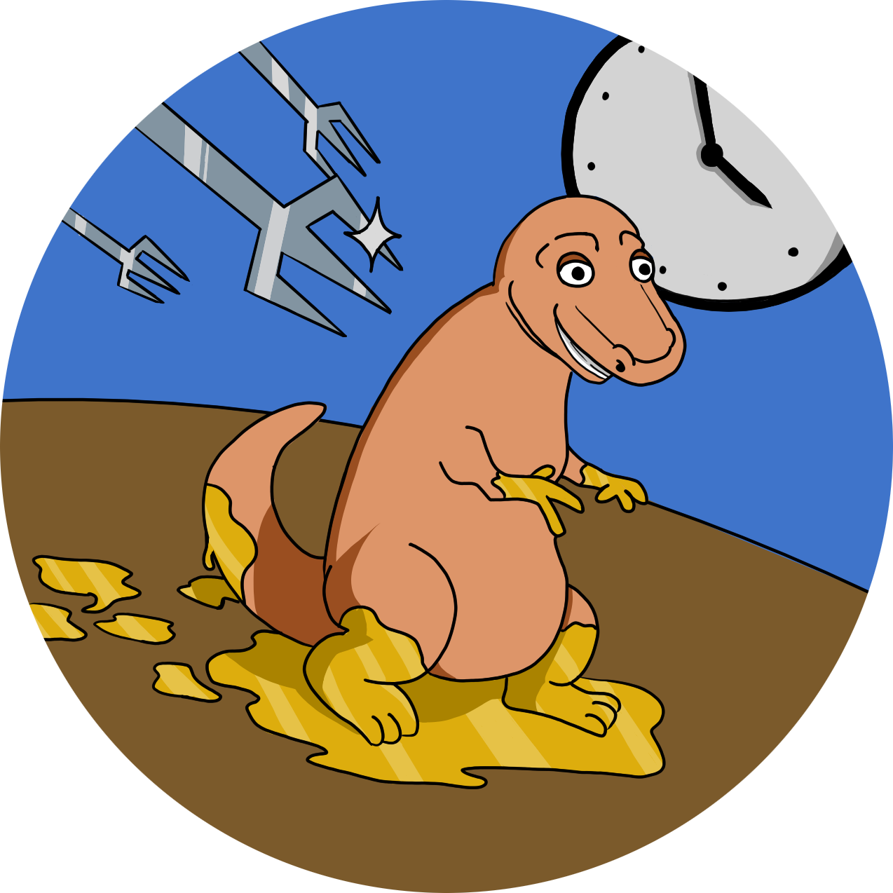

<div align="center">

</img>

<h1>Dinonuggy's Journey</h1>

<div style="
	display: flex;
	justify-content: space-around;
">

<a href="https://godotengine.org">
</img>
</a>


</div>

</div>

This is a pixel art style 2D game where you play a nugget in dinosaur shape. (Therefore the name *Dinonuggy's Journey*)

## How to play?

### Web

#### Convenient

Play the web version [here](https://coeck.codeberg.page).

#### Self hosted

Download the latest web build from [Releases](https://codeberg.org/CoEck/Dinonuggy-Journey/releases) then unzip it and serve it with your favorite web server.

### Windows

Download latest Windows build from [Releases](https://codeberg.org/CoEck/Dinonuggy/releases). To run, execute the download.

### macOS

Download latest macOS build from [Releases](https://codeberg.org/CoEck/Dinonuggy/releases). Open it and drap it into the Applications folder.

### Linux

#### [Flatpak version](https://flathub.org/apps/details/com.coeck_studios.Dinonuggys-Journey)

##### Installing

[Setup Flathub for yor distro](https://flatpak.org/setup/).

###### via App store

If your distro's app store can install flatpaks, search for `Find Billy` and click on install.

###### via Command line

Add the Flathub remote
```bash
flatpak remote-add --if-not-exists flathub https://flathub.org/repo/flathub.flatpakrepo
```
and install with
```bash
flatpak install com.coeck_studios.Dinonuggys-Journey
```

##### Running

###### via App launcher

Launch your favorite app launcher and search for `Billy`.

###### via Command line

Run
```bash
com.coeck_studios.Dinonuggys-Journey
```

## Conventions

### Folder structure

All files must be in the root folder of this repository.

### File names

- English
- no separation between words or numbers
- every word starts with a capitalized letter or number

#### Exceptions

- `.git*`
- `README.md`
- `LICENSE.md`
- `project.godot`
- `.import`
- `default_env.tres`
- `export_presets.cfg`
- `hept32.gpl`

## [Contributors](https://codeberg.org/CoEck)

## [License](LICENSE.md)
