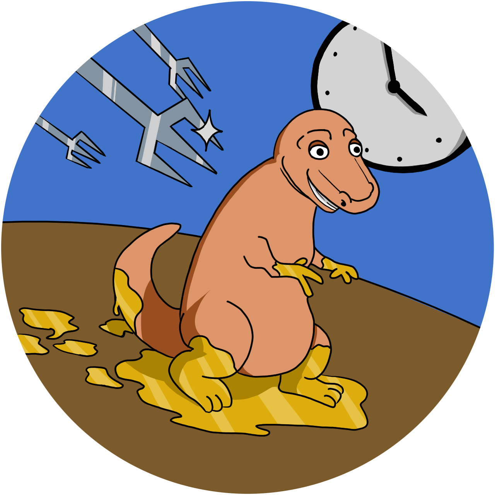

</img>

<h1>Dinonuggy's Journey</h1>

<a href="https://godotengine.org">
</img>
</a>

## What is this about?

This is a pixel art style 2D game where you play a nugget in dinosaur shape. (Therefore the name *Dinonuggy's Journey*)

## Conventions

### Folder structure

All files must be in the root folder of this repository.

### File names

- English
- no separation between words or numbers
- every word starts with a capitalized letter or number

#### Exceptions

- `.git*`
- `README.md`
- `LICENSE.md`
- `project.godot`
- `.import`
- `default_env.tres`
- `export_presets.cfg`
- `hept32.gpl`

## [Contributors](https://codeberg.org/org/CoEck/members)

## [License](LICENSE.md)
